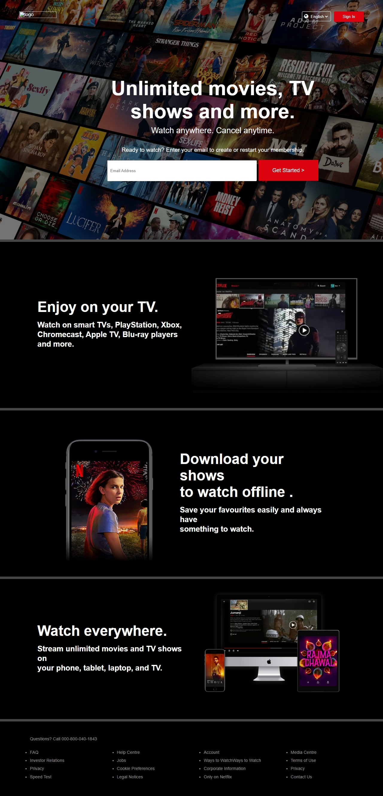

# Netflix Landing page

A simple Netflix landing page clone to test my UI/UX and simple Frontend Skills. Most basic project with simple HTML and CSS usage

## User Interface
  

## Technologies used

- HTML.

- CSS. 

## Setup

1. Clone this repository (if you haven't already):

   ```bash
   git clone https://github.com/yashsharma127/Netflix_landingpg.git
   cd Netflix_landingpg
   ```

## Note

This is a starting point and can be expanded with additional features and improvements. Happy chatting!
 
